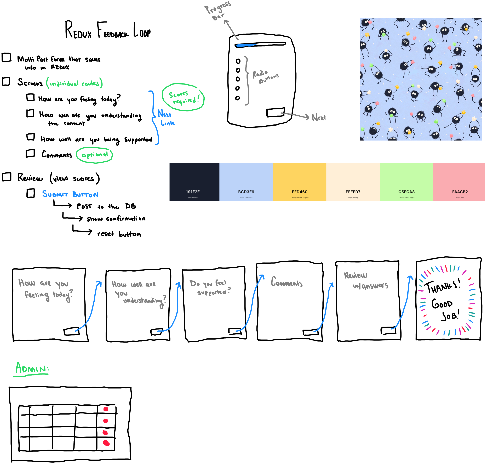

# React/Redux Feedback Loop:

## Description

_Duration: 15 hour Sprint_

Over the course of a weekend we were tasked with using our knowledge of Redux and React - along with express to create a functional Survey to collect feedback from a user ... and store it on a database.

## Screen Shots

Gallery List View followed by Item View:

## Description & Approach

As I continue to develop my personal workflow - I am trying to get into the habit of breaking down the complexity of the project at hand. One way I do this is by making a visual To-Do list / Flow Chart for me to follow. (like the one below). 

In this particular assignment - I found this useful to try and break down the task at hand into manageable React Components.

### Prerequisites
- [Node.js](https://nodejs.org/en/)
- React.js
- Axios
- Redux
- [Material.UI](https://mui.com)
- Express 
- Body-Parser
- 'PG'
- Database Manager

## Installation
1. Clone this repository for your own access.
2. Open up your editor of choice and run an `npm install`
3. Using the provided `data.sql` file - set up a database.
4. Open two Terminal Tabs
5. Run `npm run server`  and `npm run client`in your terminal
6. Navigate to http://localhost:3000/

## Usage
This web application is meant to act as a survey to collect data from students:
 1. Using the provided radio buttons answer each question in the form - using the `NEXT` button to continue navigation.
 2. Prior to pressing submit - review your answers to verify they are correct.
 3. If you wish to go back and change something - either restart the survey ... or navigate back using the provided `PREV` button.
 4. Once ready - submit your answers!
 5. Want to submit more feedback!? Use the provided `START OVER` button upon completion!
 6. Navigate to http://localhost:3000/admin to view all of the recorded answers - and `DELETE` the ones that are no longer needed.

## Developer Notes

Given the opportunity to revisit this project - I would love to continue to fine tune the theming / styling within the Material UI components.

On the Review component - I would like to give users the option to conditionally render inputs to change their scores before submitting ... instead of having to navigate to previous pages to adjust scores. I'd also like to give users the option to flag their review as important ~ in case they need to speak to someone personally about their scores. 

I would also like to add a confirmation dialogue - to prevent users from accidentally deleting the wrong row of data in Admin view. On the Admin component - I'd also like to implement something for priority sorting, or conditional rendering based on scores in the survey. 

While the project looks fine on mobile - I would like to continue to fine tune the responsiveness of the app by setting break points for mobile and different screen sizes. 

## Acknowledgement
Thanks to [Prime Digital Academy](www.primeacademy.io) who equipped and helped me to make this application a reality.
